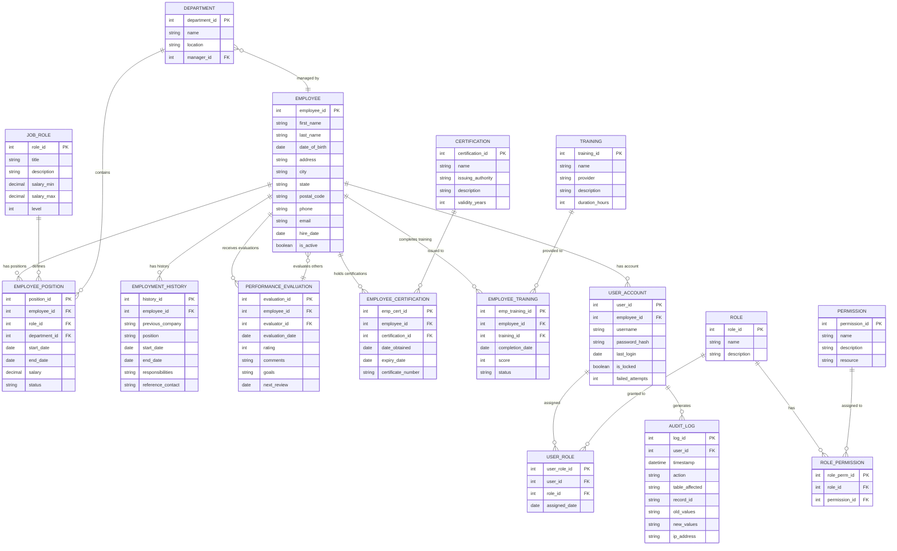

```mermaid
erDiagram
%% Core Employee Information
    EMPLOYEE {
        int employee_id PK
        string first_name
        string last_name
        date date_of_birth
        string address
        string city
        string state
        string postal_code
        string phone
        string email
        date hire_date
        boolean is_active
    }

%% Job and Department Structure
    JOB_ROLE {
        int role_id PK
        string title
        string description
        decimal salary_min
        decimal salary_max
        int level
    }

    DEPARTMENT {
        int department_id PK
        string name
        string location
        int manager_id FK
    }

    EMPLOYEE_POSITION {
        int position_id PK
        int employee_id FK
        int role_id FK
        int department_id FK
        date start_date
        date end_date
        decimal salary
        string status
    }

%% Employee History and Performance
    EMPLOYMENT_HISTORY {
        int history_id PK
        int employee_id FK
        string previous_company
        string position
        date start_date
        date end_date
        string responsibilities
        string reference_contact
    }

    PERFORMANCE_EVALUATION {
        int evaluation_id PK
        int employee_id FK
        int evaluator_id FK
        date evaluation_date
        int rating
        string comments
        string goals
        date next_review
    }

%% Certifications and Training
    CERTIFICATION {
        int certification_id PK
        string name
        string issuing_authority
        string description
        int validity_years
    }

    EMPLOYEE_CERTIFICATION {
        int emp_cert_id PK
        int employee_id FK
        int certification_id FK
        date date_obtained
        date expiry_date
        string certificate_number
    }

    TRAINING {
        int training_id PK
        string name
        string provider
        string description
        int duration_hours
    }

    EMPLOYEE_TRAINING {
        int emp_training_id PK
        int employee_id FK
        int training_id FK
        date completion_date
        int score
        string status
    }

%% User Access and Security
    USER_ACCOUNT {
        int user_id PK
        int employee_id FK
        string username
        string password_hash
        date last_login
        boolean is_locked
        int failed_attempts
    }

    ROLE {
        int role_id PK
        string name
        string description
    }

    USER_ROLE {
        int user_role_id PK
        int user_id FK
        int role_id FK
        date assigned_date
    }

    PERMISSION {
        int permission_id PK
        string name
        string description
        string resource
    }

    ROLE_PERMISSION {
        int role_perm_id PK
        int role_id FK
        int permission_id FK
    }

    AUDIT_LOG {
        int log_id PK
        int user_id FK
        datetime timestamp
        string action
        string table_affected
        string record_id
        string old_values
        string new_values
        string ip_address
    }

%% Relationships

%% Employee relationships
    EMPLOYEE ||--o{ EMPLOYEE_POSITION : "has positions"
    EMPLOYEE ||--o{ EMPLOYMENT_HISTORY : "has history"
    EMPLOYEE ||--o{ PERFORMANCE_EVALUATION : "receives evaluations"
    EMPLOYEE ||--o{ EMPLOYEE_CERTIFICATION : "holds certifications"
    EMPLOYEE ||--o{ EMPLOYEE_TRAINING : "completes training"
    EMPLOYEE ||--o{ USER_ACCOUNT : "has account"
    EMPLOYEE }o--|| PERFORMANCE_EVALUATION : "evaluates others"

%% Department and role relationships
    JOB_ROLE ||--o{ EMPLOYEE_POSITION : "defines"
    DEPARTMENT ||--o{ EMPLOYEE_POSITION : "contains"
    DEPARTMENT }o--|| EMPLOYEE : "managed by"

%% Certification and training relationships
    CERTIFICATION ||--o{ EMPLOYEE_CERTIFICATION : "issued to"
    TRAINING ||--o{ EMPLOYEE_TRAINING : "provided to"

%% User access relationships
    USER_ACCOUNT ||--o{ USER_ROLE : "assigned"
    ROLE ||--o{ USER_ROLE : "granted to"
    ROLE ||--o{ ROLE_PERMISSION : "has"
    PERMISSION ||--o{ ROLE_PERMISSION : "assigned to"

%% Audit relationships
    USER_ACCOUNT ||--o{ AUDIT_LOG : "generates"
```
